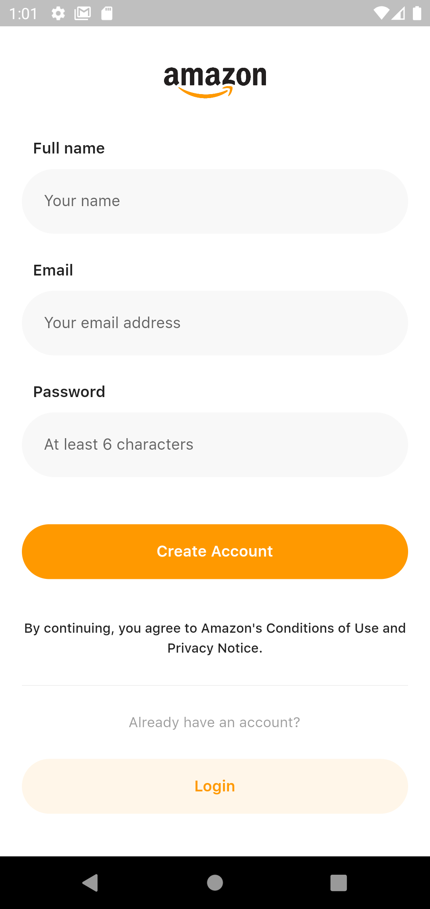
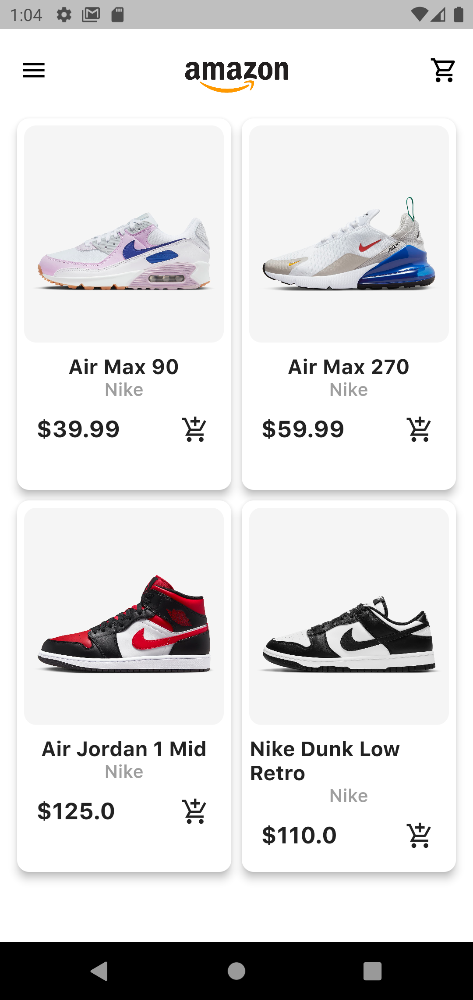
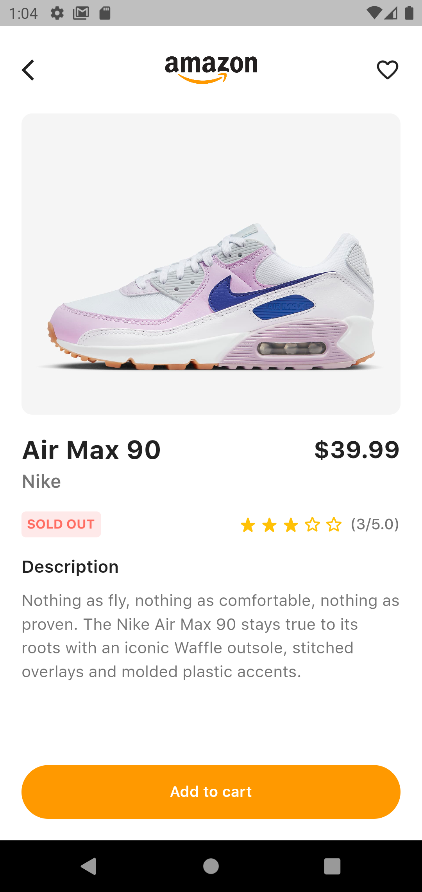

# Amazon App

> A simplified version of Amazon app built using Flutter and Node.js. Some features are still in progress. I'd consider this a starter project for creating full-stack mobile applications with Flutter.

## Screenshots

🚀 For more app screenshots see the [upload](https://github.com/fahadimran7/amazon-clone/tree/main/upload) folder.

<p>
  
  &nbsp; &nbsp;
  
  &nbsp; &nbsp;
  
  &nbsp; &nbsp;
</p>

## Design Credits

Some inspiration taken from [this design](https://dribbble.com/shots/15221406-Amazon-App) by Nikusha Tetruashvili on Dribble.

## Build Setup

```bash
# clone the repo
$ git clone https://github.com/fahadimran7/amazon-clone.git
$ cd amazon-clone

# install dependencies for express server
$ cd server
$ npm install

# install flutter packages
$ flutter pub get

# run express server using nodemon on localhost:5000
$ cd server
$ npm install

# run flutter app
$ flutter run
```

**Note:** Be sure to update `server/.env` file with your own credentials.
